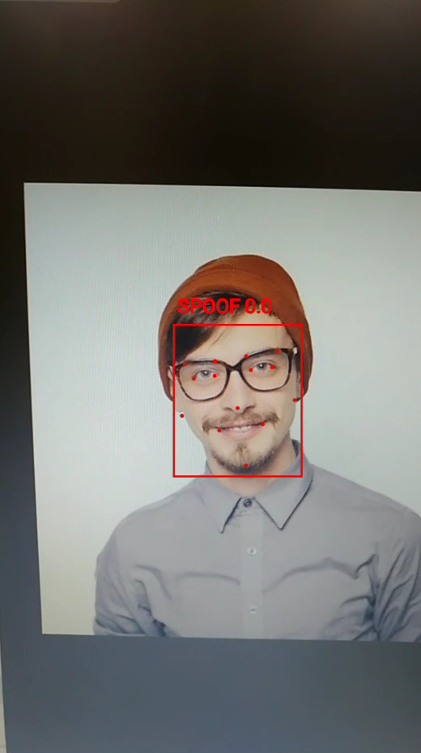
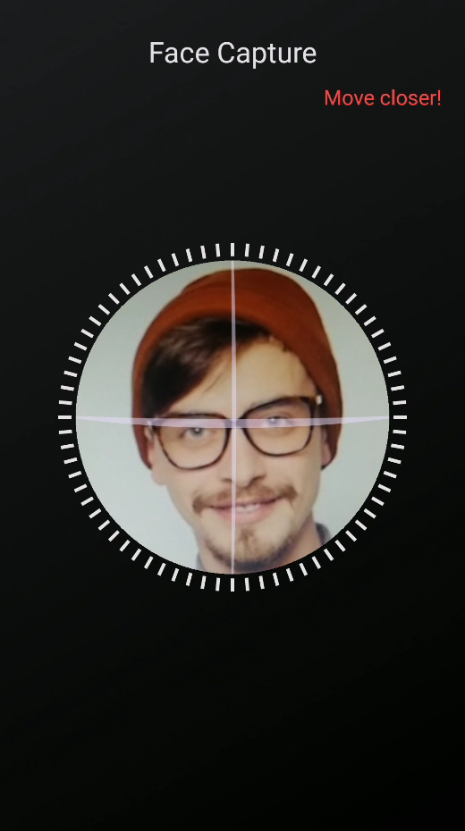
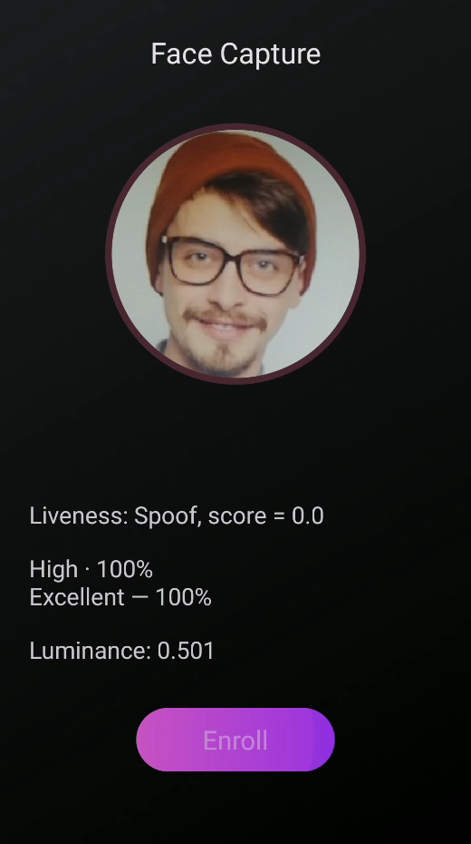
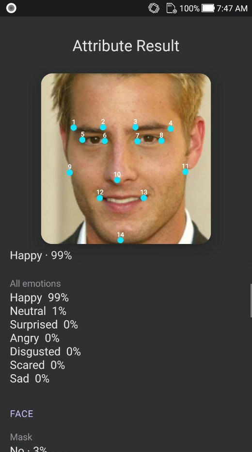
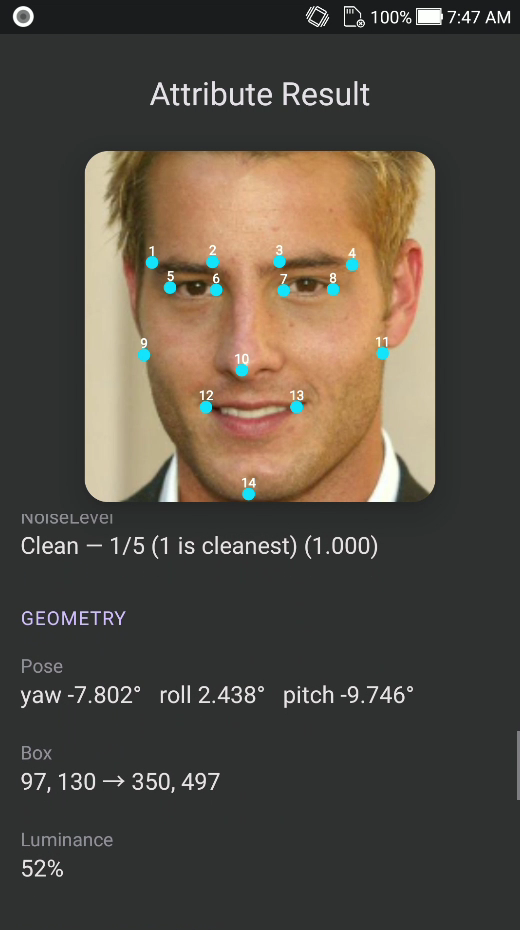
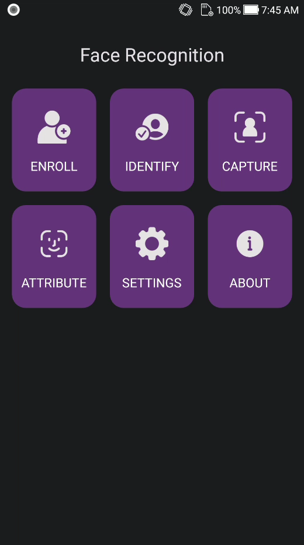
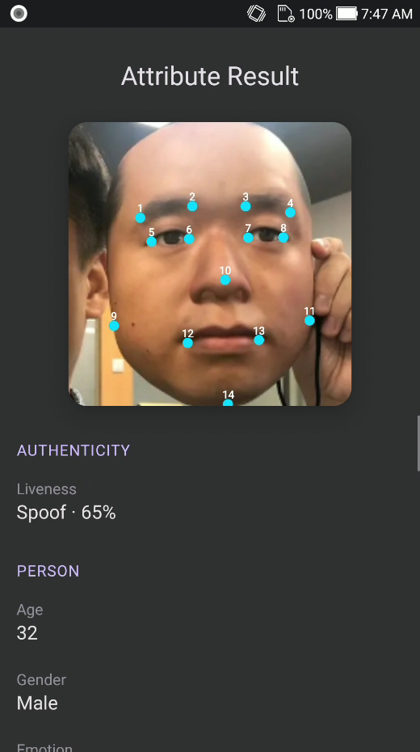

<div align="center">

</div>

#### 🌐 Company Site - [Here](https://faceplugin.com)
#### 🤗 Hugging Face - [Here](https://huggingface.co/FacePlugin-Ltd)
#### 🛟 Help Center - [Here](https://doc.faceplugin.com)
#### 🐳 Docker Hub - [Here](https://hub.docker.com/u/faceplugin)

# FacePlugin Face Recognition SDK — Android (Fully On-Premise)

> **Ready in ~10 minutes (after AAR download):**
> Drop `facerecognitionsdk.aar` into `libfacesdk/` → Run on a phone
> Jump: [Quick start](#quick-start-checklist) · [Get the AAR](#get-the-aar-libfacesdk) · [Run the demo](#run-the-demo) · [Setup](#setup-on-your-own-app) · [About SDK](#about-sdk) · [Demo kit](#demo-kit)

Customer repo: [`FaceRecognition-Android`](https://github.com/Faceplugin-ltd/FaceRecognition-Android) · Help Center: [doc.faceplugin.com](https://doc.faceplugin.com)

## Quick start checklist

- [ ] Clone `https://github.com/Faceplugin-ltd/FaceRecognition-Android`
- [ ] Download `facerecognitionsdk.aar` from [Google Drive](#get-the-aar-libfacesdk)
- [ ] Place it in `libfacesdk/` (next to `libfacesdk/build.gradle`)
- [ ] Open this folder in Android Studio → Run on a **physical** phone
- [ ] Home status bar disappears → **Enroll / Identify / Capture / Attribute** unlock

> **Your own app?** Skip to [Setup on your own app](#setup-on-your-own-app). Optional copy-paste helpers: [Demo kit](#demo-kit).

## Introduction

FacePlugin **Face Recognition SDK for Android** is a fully on-device biometric engine for KYC and mobile onboarding. Enroll faces from gallery, identify in 1:N with live camera and 2D liveness, capture with an oval coach, and read attributes (liveness, quality, pose, age, gender, emotion, and more).

All processing stays on the device. **No** biometric data is sent to FacePlugin cloud — built for banking, access control, and privacy-first identity apps.

This repository is the **Android demo app** — a **standalone** customer repo. Runtime is `libfacesdk/facerecognitionsdk.aar` (download from Google Drive). No other FacePlugin repository is required.

You get:

1. **A working demo** with six home tiles: Enroll, Identify, Capture, Attribute, Settings, About.
2. **`app/.../kit/`** — copy-paste Kotlin helpers (`FaceRecognitionClient`) so you can call every SDK function without rewriting threading, CameraX, or VideoWorker plumbing. See [Demo kit](#demo-kit).

### Main Functionalities

| Demo tile | What it does |
| --------- | ------------ |
| **Enroll** | Enroll a person from a gallery photo (exactly one face) into the on-device database |
| **Identify** | Live 1:N camera match (stop on first hit) with 2D liveness / anti-spoofing |
| **Capture** | Oval coach capture → still with attributes → optional enroll |
| **Attribute** | Gallery analysis: landmarks, liveness, pose, quality, age, gender, emotion |
| **Settings** | Camera lens, identify / liveness / pose / eye-close thresholds |
| **About** | FacePlugin Face Recognition SDK — on-device identity |

Also: 14-point landmarks, template extraction, 1:N similarity, and offline license.

### Product List

| Platform | Repository |
|----------|------------|
| **Android (Recognition)** | **[FaceRecognition-Android](https://github.com/Faceplugin-ltd/FaceRecognition-Android)** (**this repo**) |
| iOS (Recognition) | [FaceRecognition-iOS](https://github.com/Faceplugin-ltd/FaceRecognition-iOS) |
| React Native (Recognition) | [FaceRecognition-React-Native](https://github.com/Faceplugin-ltd/FaceRecognition-React-Native) |
| Flutter (Recognition) | [FaceRecognition-Flutter](https://github.com/Faceplugin-ltd/FaceRecognition-Flutter) |
| Ionic Capacitor (Recognition) | [FaceRecognition-Ionic-Capacitor](https://github.com/Faceplugin-ltd/FaceRecognition-Ionic-Capacitor) |
| Ionic Cordova (Recognition) | [FaceRecognition-Ionic-Cordova](https://github.com/Faceplugin-ltd/FaceRecognition-Ionic-Cordova) |
| Windows (Recognition) | [FaceRecognition-Windows](https://github.com/Faceplugin-ltd/FaceRecognition-Windows) |
| Linux / Docker (Recognition) | [FaceRecognition-Docker](https://github.com/Faceplugin-ltd/FaceRecognition-Docker) |
| Android (Liveness) | [FaceLivenessDetection-Android](https://github.com/Faceplugin-ltd/FaceLivenessDetection-Android) |
| iOS (Liveness) | [FaceLivenessDetection-iOS](https://github.com/Faceplugin-ltd/FaceLivenessDetection-iOS) |
| Windows (Liveness) | [FaceLivenessDetection-Windows](https://github.com/Faceplugin-ltd/FaceLivenessDetection-Windows) |
| Linux / Docker (Liveness) | [FaceLivenessDetection-Docker](https://github.com/Faceplugin-ltd/FaceLivenessDetection-Docker) |


## Before you start

| Step | What you need |
| ---- | ------------- |
| 1 | Android Studio + a **real device** (emulator is not recommended) |
| 2 | `facerecognitionsdk.aar` in `./libfacesdk/` — see [Get the AAR](#get-the-aar-libfacesdk) |
| 3 | Demo license is already in the repo (`LICENSE_KEY` for `com.faceplugin.facerecognitionsdk`). Request a new key only if you change `applicationId` — see [SDK License](#sdk-license) |

You can run the sample app as-is. Enroll / Identify / Capture / Attribute unlock when the status bar disappears.

### System requirements

`facerecognitionsdk.aar` includes native libs for **arm64-v8a** and **armeabi-v7a**. The sample app filters to those two ABIs.

| Item | Minimum | Recommended |
| ---- | ------- | ----------- |
| Android | API 24 (7.0) | API 29 (10) or newer |
| ABI | `arm64-v8a`, `armeabi-v7a` | `arm64-v8a` (typical phones) |
| RAM | 4 GB | 6 GB or more |
| CPU | 4+ cores | Mid-range SoC from ~2019 or newer |
| Camera | Front camera | 720p or 1080p |
| Device | Physical device | Same; emulator is not for camera / liveness |

## Get the AAR (`libfacesdk`)

`libfacesdk/facerecognitionsdk.aar` is empty on GitHub because the binary is too large.

### Where to download

**[FaceRecognitionSDK-Android-App runtime (Google Drive)](https://drive.google.com/drive/folders/1kpzYVv9Gbm_pEpDe9-x7FGB4NWZzvez0)**

### How to place it

1. Clone this repo (if you have not already):

```bash
git clone https://github.com/Faceplugin-ltd/FaceRecognition-Android.git
cd FaceRecognition-Android
```

2. Download `facerecognitionsdk.aar` from the Drive folder.
3. Put it **here** (not in a nested folder):

```text
FaceRecognition-Android/
└── libfacesdk/
    ├── build.gradle
    └── facerecognitionsdk.aar
```

## Run the demo

1. Open **this** folder in Android Studio.
2. Run on a device. The demo already has a valid `LICENSE_KEY` for `com.faceplugin.facerecognitionsdk`.

The warning bar on the home screen is the SDK status (`Loading native SDK…`). Enroll / Identify / Capture / Attribute stay disabled until it disappears.

Keep `applicationId` **`com.faceplugin.facerecognitionsdk`** for the included license.

### Screenshots

| Home | Identify | Capture |
| ---- | -------- | ------- |
| <p align="center"></p> | <p align="center"></p> | <p align="center"></p> |

| Capture result | Attribute | Attribute (emotion) |
| -------------- | --------- | ------------------- |
| <p align="center"></p> | <p align="center"></p> | <p align="center"></p> |

| Attribute (quality) | Settings | About |
| ------------------- | -------- | ----- |
| <p align="center"></p> | <p align="center"></p> | <p align="center"></p> |

| Home (tiles) | Attribute (liveness) |
| ------------ | -------------------- |
| <p align="center"></p> | <p align="center"></p> |

## SDK License

Licenses are **offline** and bound to your `applicationId`.

The sample app already includes a valid key for `com.faceplugin.facerecognitionsdk`. You only need a new key if you use a different `applicationId`.

### How to get a license

The code below shows how to use the license:

[https://github.com/Faceplugin-ltd/FaceRecognition-Android/blob/0548789a620a66936b15bb30d297557cb10b03d3/app/src/main/java/com/faceplugin/facerecognitionsdk/ui/MainActivity.kt#L34-L36](https://github.com/Faceplugin-ltd/FaceRecognition-Android/blob/0548789a620a66936b15bb30d297557cb10b03d3/app/src/main/java/com/faceplugin/facerecognitionsdk/ui/MainActivity.kt#L34-L36)

[https://github.com/Faceplugin-ltd/FaceRecognition-Android/blob/0548789a620a66936b15bb30d297557cb10b03d3/app/src/main/java/com/faceplugin/facerecognitionsdk/ui/MainActivity.kt#L105-L122](https://github.com/Faceplugin-ltd/FaceRecognition-Android/blob/0548789a620a66936b15bb30d297557cb10b03d3/app/src/main/java/com/faceplugin/facerecognitionsdk/ui/MainActivity.kt#L105-L122)

Please [contact us](#contact) to get a license for **your own app**.

## Setup on your own app

You need `libfacesdk/` (the AAR) and `com.faceplugin.facerecognitionsdk.FaceRecognitionSDK`. You do **not** need this demo’s Activities.

Optional: also copy `app/src/main/java/com/faceplugin/facerecognitionsdk/kit/` — that is the fastest way to use every function. See [Demo kit](#demo-kit).

1. Copy the `libfacesdk` folder into your project root.
2. Put `facerecognitionsdk.aar` inside it (from [Drive](#get-the-aar-libfacesdk)).
3. Wire Gradle:

`settings.gradle`:

```gradle
include ':app'
include ':libfacesdk'
```

`app/build.gradle`:

```gradle
android {
    defaultConfig {
        minSdk 24
        ndk {
            abiFilters 'arm64-v8a', 'armeabi-v7a'
        }
    }
    packaging {
        jniLibs {
            useLegacyPackaging = true
        }
    }
}
dependencies {
    implementation project(':libfacesdk')
    // only if you copy kit/ CameraPreview + CameraFrameUtils:
    def camerax = '1.4.2'
    implementation "androidx.camera:camera-core:$camerax"
    implementation "androidx.camera:camera-camera2:$camerax"
    implementation "androidx.camera:camera-lifecycle:$camerax"
    implementation "androidx.camera:camera-view:$camerax"
}
```

4. Add permissions in your `AndroidManifest.xml`:

```xml
<uses-feature android:name="android.hardware.camera" android:required="true" />
<uses-permission android:name="android.permission.CAMERA" />
<uses-permission android:name="android.permission.READ_MEDIA_IMAGES" />
<uses-permission
    android:name="android.permission.READ_EXTERNAL_STORAGE"
    android:maxSdkVersion="32" />
```

The license is bound to **your** `applicationId`. Request a key for that id, not the demo’s.

Then follow [About SDK](#about-sdk). Call `init` and all process methods **off the UI thread**. First `init` unpacks the on-device models (a few seconds). Full API: [doc.faceplugin.com](https://doc.faceplugin.com).

## About SDK

Public class: `com.faceplugin.facerecognitionsdk.FaceRecognitionSDK` (Java; call it from Kotlin the same way). All work stays on the device. `0` = `SDK_SUCCESS`.

Call **once per process**, on a **background** thread: `setActivation` → `init`. The engine is **not** concurrent — serialize calls (or copy the [Demo kit](#demo-kit)). Do not copy `MainActivity` / `CameraActivity` unless you want the demo UI.

| Your product needs | Call this |
| ------------------ | --------- |
| Start the engine | `setActivation` → `init` |
| Find a face / attributes | `faceDetection` (`FaceDetectionParam.allAttributes()` for liveness, age, gender, …) |
| Save a person | `templateExtraction` → store `byte[]` in **your** DB |
| 1:1 / 1:N | `similarityCalculation` (loop for 1:N) |
| Live camera box + 1:N | `VideoWorker` (`start` → `syncDatabase` → `addFrame`) |
| Stop | `stopVideoWorker` then `deinit` |

```kotlin
Thread {
    var ret = FaceRecognitionSDK.setActivation(context, "FP1.…")
    if (ret == FaceRecognitionSDK.SDK_SUCCESS) {
        ret = FaceRecognitionSDK.init(context)
    }
    // ret == 0 → enable camera / gallery
}.start()
```

| Code | Constant | Status |
| ---- | -------- | ------ |
| 0 | `SDK_SUCCESS` | Activate / init OK |
| 1 | `SDK_LICENSE_INVALID` | Invalid license |
| 2 | `SDK_LICENSE_EXPIRED` | Expired license |
| 3 | `SDK_NOT_ACTIVATED` | Not activated |
| 4 | `SDK_INIT_FAILED` | Init failed |

## Demo kit

`app/src/main/java/com/faceplugin/facerecognitionsdk/kit/` is **not** inside the AAR. Copy that Kotlin folder if you want the demo’s wiring instead of calling `FaceRecognitionSDK` yourself.

Use **`FaceRecognitionClient.get(context)`** as the only entry. Do not mix raw `FaceRecognitionSDK.*` on other threads while the client is running.

| File | Use it for |
| ---- | ---------- |
| `FaceRecognitionClient` | Activate, detect, enroll, 1:N, VideoWorker |
| `FaceRecognitionQueue` | Serial native access; live `addFrame` does not block CameraX |
| `FaceDatabase` | Local enrolled people (`filesDir/face_database.json`) |
| `CameraFrameUtils` / `CameraPreview` | `ImageProxy` → bitmap; CameraX bind |
| `LiveDetect` / `IdentityLiveness` | Live 2D liveness / eyes + active-liveness configs |
| `FaceJson` / `FaceModels` | Parse detect JSON and VideoWorker events |

```kotlin
val client = FaceRecognitionClient.get(this)
client.activate("FP1.…") { code ->
    runOnUiThread {
        if (code == FaceRecognitionSDK.SDK_SUCCESS) {
            client.loadDatabase()
        }
    }
}
```

Skip the kit if you already have a camera pipeline and a person DB — then call `FaceRecognitionSDK` on **one** background thread.

## Contact

<div align="left">
<a target="_blank" href="mailto:info@faceplugin.com"></a>&emsp;
<a target="_blank" href="https://wa.me/+14692784822"></a>
</div>
